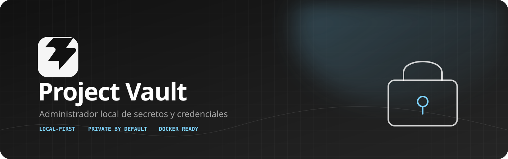
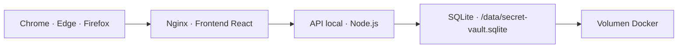

<div align="center">
  

  <p>
    <a href="#inicio-rápido"></a>
    <a href="#arquitectura"></a>
    <a href="#desarrollo-local"></a>
    
  </p>

  <p><strong>Guarda lo importante. Mantén el control.</strong><br />Una bóveda personal para variables de entorno, credenciales y secretos de tus proyectos.</p>
</div>

<br />

## El problema

Las credenciales terminan repartidas entre notas, archivos `.env`, chats y gestores que requieren cuentas o servicios externos. Secret Vault propone una alternativa deliberadamente pequeña: una interfaz clara, una base SQLite local y un volumen Docker que permanece bajo tu control.

> **Diseñado para uso local y privado.** Esta versión no publica datos, no necesita nube y no incluye autenticación ni cifrado en reposo todavía.

## Qué puedes hacer

<table>
  <tr>
    <td width="50%">🔐 <strong>Guardar secretos</strong><br />Variables de entorno y credenciales en un solo lugar.</td>
    <td width="50%">🗂️ <strong>Organizar por proyecto</strong><br />Cada secreto conserva el contexto de su aplicación.</td>
  </tr>
  <tr>
    <td>🏷️ <strong>Etiquetar y filtrar</strong><br />Tags con color para encontrar lo que necesitas rápido.</td>
    <td>👁️ <strong>Revelar bajo demanda</strong><br />Valores sensibles ocultos hasta que decides verlos o copiarlos.</td>
  </tr>
  <tr>
    <td>🌗 <strong>Tema claro y oscuro</strong><br />Una interfaz cómoda para trabajar durante todo el día.</td>
    <td>💾 <strong>Persistencia real</strong><br />SQLite en un volumen Docker, independiente del navegador.</td>
  </tr>
</table>

## Por qué existe

Secret Vault está pensado para una persona que necesita consultar sus credenciales con frecuencia, pero no quiere depender de una cuenta, una nube o un navegador específico.

- **Local por defecto:** los datos viven en tu instalación.
- **Organizado por contexto:** los secretos pertenecen a proyectos, no a una lista plana.
- **Discreto:** la interfaz es sobria y el color se reserva para estados y tags.
- **Ligero:** Docker + Node + SQLite; sin servidor de base de datos separado.
- **Portable:** puedes llevar el proyecto a otro equipo y crear una instalación independiente.

## Arquitectura



El navegador ya no guarda la información en IndexedDB. Dos navegadores que accedan a la misma instancia local verán los mismos proyectos y secretos:

```text
Chrome ─┐
        ├── http://localhost:5174 ── API ── SQLite del volumen Docker
Edge  ──┘
```

Cada instalación mantiene su propia base. Compartir el repositorio o la imagen no comparte secretos entre compañeros.

## Inicio rápido

### Requisitos

- [Docker Desktop](https://www.docker.com/products/docker-desktop/)
- Git, si vas a clonar el repositorio

### Ejecutar con Docker

```bash
git clone <URL_DEL_REPOSITORIO>
cd secret-vault
docker compose up -d --build
```

Abre **[http://localhost:5174](http://localhost:5174)**.

La aplicación levanta dos servicios:

| Servicio | Función | Acceso |
| --- | --- | --- |
| `web` | Frontend React servido por Nginx | `localhost:5174` |
| `api` | API local y SQLite | Solo red interna de Docker |

## Persistencia

La base se almacena en el volumen nombrado `secret-vault_secret-vault-data`.

Detener y volver a iniciar conserva los datos:

```bash
docker compose down
docker compose up -d
```

Eliminar también la base local:

```bash
docker compose down -v
```

⚠️ `docker compose down -v` elimina permanentemente el volumen y los secretos guardados en él. La funcionalidad de backup cifrado se incorporará en una fase posterior.

## Desarrollo local

Instala las dependencias:

```bash
npm install
```

En una terminal, inicia la API:

```bash
npm run dev:api
```

En otra terminal, inicia Vite:

```bash
npm run dev
```

Abre **[http://localhost:5174](http://localhost:5174)**.

En desarrollo, Vite redirige `/api` a `localhost:3001` y la base se crea en `data/secret-vault.sqlite`. Ese directorio está excluido de Git.

## Operaciones disponibles

La API local expone el CRUD necesario para la aplicación:

```text
GET/POST              /api/projects
GET/PATCH/DELETE      /api/projects/:id
GET                   /api/projects/:id/secrets
POST/PATCH/DELETE     /api/secrets/:id
GET                   /api/projects/:id/tags
POST/PATCH/DELETE     /api/tags/:id
GET                   /api/health
```

## Seguridad actual

Esta primera versión está deliberadamente acotada:

- No requiere cuentas ni autenticación.
- No cifra la base SQLite en reposo.
- No sincroniza datos entre equipos.
- No incluye importar, exportar ni backups cifrados.
- Publica la aplicación solo en `127.0.0.1:5174`.
- No debe desplegarse directamente en Internet.

Si compartes el proyecto con compañeros, cada uno debe ejecutar su propia instalación y proteger el equipo donde guarda su volumen Docker.

## Hoja de ruta

- [x] CRUD de proyectos, secretos y tags
- [x] Persistencia SQLite independiente del navegador
- [x] Docker Compose con volumen nombrado
- [x] Tema claro y oscuro
- [ ] Exportación e importación cifrada
- [ ] Backups seguros
- [ ] Capa opcional de autenticación local

## Calidad local

```bash
npm run build
npm run lint
```

## Estado del proyecto

Secret Vault es una herramienta personal en evolución. El objetivo no es convertirse en un servicio público, sino ofrecer una bóveda local, clara y controlable para el trabajo diario.

<div align="center">
  <br />
  <sub>Hecho para mantener tus secretos cerca y tus dependencias bajo control.</sub>
</div>
